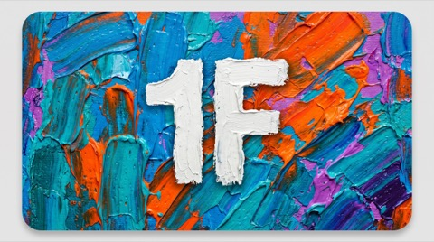

```
   __    _____
  /_ |  |  ___|
   | |  | |__
   | |  |  __|
   | |  | |
   |_|  |_|
```

# First Friday

In many cities the first Friday of every month is gallery night: art venues stay open late and people walk between them. Sometimes there is music.

This is not a monthly fun art event.  It is tvOS app: a BYO art-gallery-and-music app for Apple TV. 


## Installation

Download the source code, compile it, and install it on your own Apple TV from Xcode. (Or just vibe code your own equivalent.  This whole app was maybe 2 hours of work.) Pain in the butt, huh?  Apple needs to allow for more ad-hoc distribution of apps.

## Setup

The purpose of the app is to display your own collection of artwork, from a WebDAV server.  It bundles a small number of paintings if you want to try out the app without one.

On my home network, I host a collection of images sourced from Wikiart on a Raspberry Pi. It is not hard to set up, and for those that do not want to host their own artwork collections, there are plenty of other art gallery apps in the Apple TV app store.

The app supports playing no music at all, of course.  It also offers some internet radio stations that I happen to like as pre-sets, and lets you put in your own radio station URL.

## Controls

During the slideshow:

- **Left / Right** — previous / next image
- **Up** — show overlay with the now-playing track and the filename/path of the current image
- **Click while overlay is up** — open Settings
- **Any other button while overlay is up** — dismiss

I'd like better metadata but full paths/filenames (e.g. High_Renaissance/dosso-dossi_jupiter-mercury-and-virtue-1524.jpg) is the best I can do.

## Built-in Stuff

- Leonardo da Vinci, Mona Lisa, c. 1503–1519.- 
- Sandro Botticelli, The Birth of Venus, c. 1484–1486.
- Johannes Vermeer, Girl with a Pearl Earring, c. 1665.
- Katsushika Hokusai, The Great Wave off Kanagawa, c. 1831.
- Vincent van Gogh, The Starry Night, 1889.
- Gustav Klimt, The Kiss, 1907–1908.  


- WFMU , Freeform, Jersey City
- KEXP, Seattle public radio, music-focused 
- KCRW, Santa Monica public radio (eclectic / news)
- WPRB, Princeton college radio
- WETA Classical, DC classical
- Radio 1190, CU Boulder college radio
- NTS Radio 1 / 2, London, two live channels
- BBC World Service, International news/talk 
- BBC Radio 1, UK pop
- BBC Radio 2, UK adult contemporary
- BBC Radio 3, UK classical & jazz
- BBC Radio 4, UK news, drama, comedy
